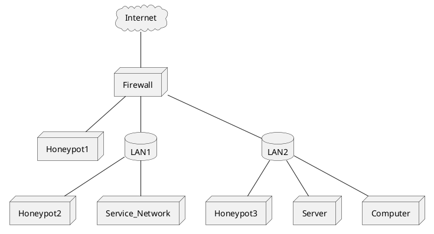
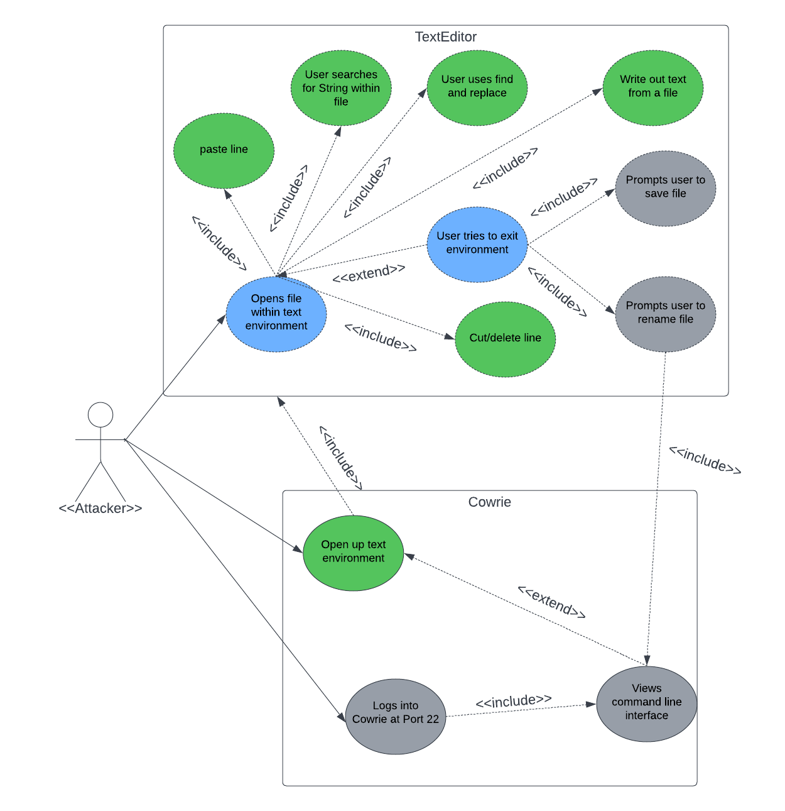

# ENGR 301: Architectural Design and Proof-of-Concept

## Proof-of-Concept

The aim of an architectural proof-of-concept (spike or walking skeleton) is to demonstrate the technical feasibility of your chosen architecture, to mitigate technical and project risks, and to plan and validate your technical and team processes (e.g., build systems, story breakdown, Kanban boards, acceptance testing, deployment).

A walking skeleton is an initial technical attempt that will form the architectural foundation of your product. Since a walking skeleton is expected to be carried into your product, it must be completed to the quality standards expected for your final product. A walking skeleton should demonstrate all the technologies your program will rely on "end-to-end" &mdash; from the user interface down to the hardware.

In the context of ENGR 301, a walking skeleton does not need to deliver any business value to your project: the aim is technical validation and risk mitigation.

## Document

The aim of the architectural design document is to describe the architecture and high-level design of the system your group is to build, to identify any critical technical issues with your design, and to explain how you have addressed the highest rated technical and architectural risks. The architecture document should also demonstrate your understanding of architectural techniques and architectural quality, using tools and associated notations as necessary to communicate the architecture precisely, unambiguously and clearly in a written technical document.

Page specifications below are *limits not targets* and refer to the pages in the PDF generated from the markdown. Because the size of your document is necessarily limited, you should ensure that you focus your efforts on those architectural concerns that are most important to completing a successful system: if sections are at their page limit, indicate how many items would be expected in a complete specification.

The ENGR 301 project architecture design document should be based on the standard ISO/IEC/IEEE 42010:2011(E) _Systems and software engineering &mdash; Architecture description_, plus appropriate sections from ISO/IEC/IEEE 29148:2018(E) _Systems and software engineering &mdash; Life cycle processes &mdash; Requirements engineering_; ISO/IEC/IEEE 15289:2017 _Systems and software engineering &mdash; Content of life-cycle information items (documentation)_; ISO/IEC/IEEE 15288:2015 _Systems and software engineering &mdash; System life-cycle processes_; ISO/IEC/IEEE 12207:2017 _Systems and software engineering &mdash; Software life cycle processes_ and ISO 25010 SQuaRE; with notations from ISO/ISE 19501 (UML). In particular, Annex F of ISO/IEC/IEEE 15288 and Annex F of ISO/IEC/IEEE 12207. These standards are available through the Victoria University Library subscription to the [IEEE Xplore Digital Library](https://ieeexplore.ieee.org/) (e.g., by visiting IEEE Xplore from a computer connected to the University network).

The document should contain the sections listed below, and conform to the formatting rules listed at the end of this brief.

All team members are expected to contribute equally to the document and list their contributions in the last section of the document (please make sure that your continued contribution to this document can be traced in GitLab). You should work on your document in your team's GitLab repository in a directory called "M2_Architecture". If more than one team member has contributed to a particular commit, all those team member IDs should be included in the first line of the git commit message. ``git blame``, ``git diff``, file histories, etc. will be tools used to assess individual contributions, so everyone is encouraged to contribute individually (your contribution should be made to many sections of the document, rather than focusing on just a single section), commit early and commit often.

---

# ENGR 301 Project *NN* Architectural Design and Proof-of-Concept

**Authors:** a comma-separated list of the names of each member of the team.

## 1. Introduction

One page overall introduction including sections 1.1 and 1.2 (ISO/IEC/IEEE 42010:2011(E) clause 5.2)

The Supercharged Cowrie project is expected to expand the current capability of the Cowrie honeypot server, which is utilized to bait cyber attacks. The Cowrie system logs attackers' behaviour to help inform the user how to be better prepared for future attacks, when designing other systems.

### Client

Identify the client and their contact details.

Client Contact Details: 
Client:  Masood Mansoori, PhD. M.Sc. B.Sc. 
Email: masood.mansoori@vuw.ac.nz 
Work Phone: 04 886 5369 
University Office: CO 130, Cotton Building

### 1.1 Purpose

One sentence describing the purpose of the system.

The purpose of this project is to extend the functionality of the Cowrie system. The purpose of the extensions is to simulate functions of a real operating system, to entice cyber attacks and log the data generated by these attacks.
### 1.2 Scope

One paragraph describing the scope of the system.

The scope of the Supercharged Cowrie project will be fairly elementary. The Client has stated they do not wish for a fully-fledged editor, with reliance on external libraries; but rather an editor that runs on basic script and can fulfill basic editing functionalities. These functionalities include typical commands taht come with simulating an operating system, for example: nano, pwd, mkdir, whoami etc.

### 1.3 Changes to requirements

If the requirement have changed significantly since the requirements document, outline the changes here. Changes must be justified and supported by evidences, i.e., they must be substantiated. (max one page, only if required)

## 2. References

References to other documents or standards. Follow the IEEE Citation Reference scheme, available from the [IEEE website](https://ieee-dataport.org/sites/default/files/analysis/27/IEEE%20Citation%20Guidelines.pdf) (PDF; 20 KB). (1 page, longer if required)

## 3. Architecture

Describe your system's architecture according to ISO/IEC/IEEE 42010:2011(E), ISO/IEC/IEEE 12207, ISO/IEC/IEEE 15289 and ISO/IEC/IEEE 15288.

Note in particular the note to clause 5 of 42010:

_"The verb include when used in Clause 5 indicates that either the information is present in the architecture description or reference to that information is provided therein."_

This means that you should refer to information (e.g. risks, requirements, models) in this or other documents rather than repeat information.

### 3.1 Stakeholders

See ISO/IEC/IEEE 42010 clause 5.3 and ISO/IEC/IEEE 12207 clause 6.4.4.3(2).

For most systems this will be about 2 pages, including a table mapping concerns to stakeholder.

For this project, our stakeholders will be:
| Stakeholder  | Role |
| ------------- | ------------- |
| Team members  | Developing Cowrie |
| Masood Mansoori | Client |
| Project Manager  | Project Manager |
| Jesse Wood | Tutor |
| Winston Seah  | Owner |
| User  | Using end product |

| Stakeholder  | Main Concern |
| ------------- | ------------- |
| Team members  | Developing Cowrie to meet Client requirements on time  |
| Masood Mansoori  | Team producing the correct end product  |
| Project Manager  | Managing the team's communication and progress  |
| Jesse Wood  | Ensuring team is informed and aware of requirements  |
| Winston Seah  | Ensuring the team satisfies the client's requirements and expectations  |
| Users  |  Results of the final product  |

### 3.2 Architectural Viewpoints
(1 page, 42010 5.4) 

Identify the architectural viewpoints you will use to present your system's architecture. Write one sentence to outline each viewpoint. Show which viewpoint frames which architectural concern.

### 4. Architectural Views

(5 sub-sections of 2 pages each sub-section, per 42010, 5.5, 5.6, with reference to Annex F of both 12207 and 15288) 

Describe your system's architecture in a series of architectural views, each view corresponding to one viewpoint.

You should include views from the following viewpoints (from Kruchten's 4+1 model):

 * Logical
 * Development
 * Process
 * Physical 
 * Scenarios - present scenarios illustrating how two of your most important use cases are supported by your architecture

As appropriate you should include the following viewpoints:

 * Circuit Architecture
 * Hardware Architecture

Each architectural view should include at least one architectural model. If architectural models are shared across views, refer back to the first occurrence of that model in your document, rather than including a separate section for the architectural models.

### 4.1 Logical
...

### 4.2 Development
...

### 4.3 Process
...

### 4.4 Physical 

Cowrie has been built as a virtual honeypot. Therefore, there is very little in terms of physical requirements for this project. It can be set up on any server or computer that has Python 3.7+ and Python-virtualenv installed and is connected to a network. 

The extensions that are being developed for Cowrie will utilise the same virtual environment that Cowrie is currently run within. This means that the extensions will use the systems and protocols within Cowrie to connect to a network and send and receive information. There are multiple areas within a network a honeypot should be set up as displayed in Figure 4.4.1. These include outside of the networks firewall, along side the service network servers and among the end users and main servers of the network. 
 

*Figure 4.4.1: Honeypots within a network*

### 4.5 Scenarios

This is a UML use case diagram that displays each essential use case for the extended iteration of Cowrie. Which will primarily have support for a decently fleshed out text edtior. The usecases highlighted in blue represent two of the most important and essential functionalities for the text editor. The guide for maintaining a minimum viable product are as follows. Use Cases highlighted in green highlight the features and use cases/scenarios that the Text editor would have support for.

#### 4.5.1 Opening Files Within the Text Environment

Users/Attackers logged into the Cowrie using the text editor would need support for opening files within or outside the text environment - eg. nano (filename), or using the read file functionality within the editing environment. Either scenario would produce or summon a text editing environment for a user to utilise and edit files.

#### 4.5.2 User Exits Out of the Environment

Another scenario which would also be considered is also allowing users to exit out of the environment when they please. This scenario would also include use cases such as prompting a user to save the file they have made changes to, and prompting the user to rename the file if they please. 

## 5. Development Schedule

_For each subsection, make clear what (if anything) has changed from the requirements document._ If unchanged, these sections should be copied over from the requirements document, not simply cross-referenced.

Schedules must be justified and supported by evidences; they must be either direct client requirements or direct consequences of client requirements. If the requirements document did not contain justifications or supporting evidences, then both must be provided here.

### 5.1 Schedule

Identify dates for key project deliverables:

1. July 31st - Architectural Prototype 
1. August 19th - Minimum Viable Product
1. October 1st - Further Releases

(1 page).

### 5.2 Budget and Procurement

The Supercharged Cowrie project is software based, therefore we do not require any physical equipment or resources outside of our reach to complete it. Therefore this project does not have a budget.

#### 5.2.1 Budget

Present a budget for the project (as a table), showing the amount of expenditure the project requires and the date(s) on which it will be incurred. Substantiate each budget item by reference to fulfilment of project goals (one paragraph per item).

(1 page). 

#### 5.2.2 Procurement

Present a table of goods or services that will be required to deliver project goals and specify how they are to be procured (e.g. from the School or from an external organisation). These may be software applications, libraries, training or other infrastructure, including open source software. Justify and substantiate procurement with reference to fulfilment of project goals, one paragraph per item.
(1 page).

### 5.3 Risks 

Identify the ten most important project risks: their type, likelihood, impact, and mitigation strategies (3 pages).
Risks  done by Shruti 

Risk: Tripping 
Likelihood: Likely 
Impact: Light - severe 
Can cause: Painful injuries resulting in members being unable to participate and contribute 
Mitigation: Ensure work areas and walkways are well-lit. Keep floor clear. Keep bags, cords etc under tables at all times. No running. Keep work area clutter free. 

Risk: Spending large amounts of time looking at the screen. 
Likelihood: Very likely 
Impact: Light - severe 
Can cause: headaches, blurry vision, dry eyes, and neck and shoulder pain 
Mitigation: Follow the 20-20-20 rule. Every 20 minutes look away from your screen and look at an object 20 feet away for at least 20 seconds. Practice regular breaks and avoid unnecessary screen use. 

Risk: Sitting at the desk for long periods of time. 
Likelihood: Very likely 
Impact: Moderate 
Can Cause: Bad posture, back pain. 
Mitigation: Educate members about their head position; try to keep the weight of the head directly above the neck. Encourage team members to take short walks

Risk: Papercuts 
Likelihood: Unlikely 
Impact: Light 
Can Cause: Bleeding, pain and discomfort 
Mitigation: Avoid using paper - it is not necessary for this project 

Risk: Lifting/carrying heavy items such as computer equipment or other personal belongings. 
Likelihood: Likely 
Impact: Moderate 
Can Cause: Injuries if something is dropped, muscle sprains and strains 
Mitigation: Position items so they are easily accessible for everyone. Provide assistance to members if required.[2] 

Risks done by Lucy 

Risk: RSI (Repeated Strain Injury) 
Likelihood: Likely 
Impact: Moderate - Severe 
Can Cause: Long term pain doing day to day tasks, inability to do select tasks, expenses in the form of medical appointments, loss of quality of life, potential of injury in other tasks increases, permanent damage to muscles and ligaments, more likely to develop sciatica, more likely to develop carpal tunnel. 
Mitigation: Maintain a good posture whilst sitting at a desk. Frequent small breaks to stretch and readjust position at desk, and monitor posture. Take regular breaks while doing long and or repetitive tasks. If you are stressed, try breathing exercises, and focus on relaxing muscles to avoid strain and cramp. Unclench your jaw often to avoid pain there. Keep wrists flat and straight while writing. If pain is beginning to occur, do not ignore it, instead get up, move around, and make sure someone else in the team is aware that you may be in pain. 

Risk: Contracting Covid-19 
Likelihood: Very Likely 
Impact: Severe 
Can Cause: Widespread infection amongst the team, limiting ability to work on project. Can result in Long Covid in some individuals. Can also result in death if not treated properly. 
Mitigation: Wear masks at all times when social distancing is not possible, sanitize and wash hands before eating food, sanitize hands after coming into contact with door handles etc. Avoid touching each other (ie handshakes). Ensure that if you have symptoms of Covid-19 that you take a test immediately, and isolate and inform all team members immediately if the test is postive. If you test positive, follow all government and health instructions. Make sure to rest lots, and take breaks from screens. Do not push yourself to return to study, as pushing yourself too soon can increase the chance of developing long covid. 

Risk: Electrical Fires 
Likelihood: Unlikely 
Impact: Severe 
Can Cause: Burns, loss of equipment, loss of life, smoke inhalation, electrocution, damage to university property.
Mitigation: Avoid overloading power points, ensure chargers and laptops are not being used on flammable surfaces, and monitor chargers, phones and laptops for overheating. Particularly those with metal framed laptops, monitor the health of the device, and the heat it is putting out. Familiarise selves with nearest C02 fire extinguisher (Carbon Dioxide extinguisher), and/or the nearest Dry Powder extinguisher. If an electrical fire is to occur, locate the nearest C02 or Dry Powder extinguisher, and follow instructions on the extinguisher. Ensure that someone on the team activates the nearest fire alarm. DO NOT USE WATER ON AN ELECTRICAL FIRE. 

Risk: Spillage of food & liquids 
Likelihood: Likely 
Impact: Moderate 
Can Cause: Damage to computers, sticky mess to clean up, slipping hazard, damage to university property, reduction in teams ability to work on project, damage to hard drives, loss of progress, electrical failures. 
Mitigation: No food near computers. Only drinks in sealed, spillproof containers. Only have water in a sealed spill proof bottle in the laboratories. If spillage does occur, ensure it is cleaned up immediately, and notify other team members of the spill. If possible, find a wet floor sign to put up near the spill, to avoid other people slipping.

Risk: Stress/Arguments/Anger/Disagreements within the team. 
Likelihood: Very Likely 
Impact: Severe 
Can Cause: Physical confrontation amongst team members, hostility and emotional distress, inability to complete work as a team, a flawed end product, lasting resentment towards team members after the project has ended. Can damage team relationships, and  affect individual and team grades. Hostility between team members in front of client can jeopardise clients perception of the team. 
Mitigation: Be mindful of the way team interacts - mindful of body language, tone, and facial expressions. If tension is brewing, make sure to take a breather from working with whoever the tension is with, and step outside. Do nottry and resolve conflicts whilst emotional. If a problem occurs, let the team know, as it is important to resolve conflict before it escalates. Maintain good communication with the team. Be mindful of interactions around deadlines, as all team members will be feeling tense close to deadlines. Maintain clear and consistent communication in the lead up to any and all deadlines. If conflict cannot be resolved one to one with team mates, escalate up the hierachy to the team tutor, and further if needed. Best way to mitigate problems is to solve them as soon as they occur - do not allow conflict to fester and grow.

### 5.4 Health and Safety

Document here project requirements for Health and Safety.

The team will manage computer related risks by following the mitigation strategies listed in the section above. To manage Occupational Over Use, team members will be aware to stop when they have any sort of disomfort, and take frequent breaks to adjust posture and hand placement. The team will be made aware of the correct positions for hands while typing, and correct posture for working at a desk. Frequent breaks will be the best way to manage risks of Occupational Over Use. 
The team will manage cables by ensuring that powerpoints are not overloaded, and computer charging cables are laid out in such a way that tangles should not happen. In the laboratories computer cables will be placed along places that are there to leave cables in. In the event that a team member needs an extra cable to be plugged into something, the team member will ensure that there is enough space in the plug socket without overloading it, and make sure that the cable is laid out correctly to ensure that the cables are managed correctly. 

The project does not require work or testing at any external workplaces or sites. All work is software based, and will take place in either the university computer laboratories, university libraries, university campus seating, or at the team members own place of residence. All team members will adhere to the university computer safety requirements while on campus, and adhere to safety guidelines around computer use when working at their own place of residence. 

The project does not require and human or animal testing. All software testing will be done within the team by the team members, and does not require Ethics Approval. 

For the duration of this project, the team is required to adhere to all university policies, government laws, and Covid-19 health orders. It is the responsibility of each team member to read through the possible risks of this project, and familiarise themselves with the mitigation strategies listed. The list of risk and mitigation strategies may not be inclusive, and all team members are encouraged to add to the list as they see fit.

#### 5.4.1 Safety Plans

Safety Plans may be required for some projects, depending on project requirements.

Project requirements do not involve risk of death, serious harm, harm or injury

## 6. Appendices

### 6.1 Assumptions and dependencies 

 
Supercharged Cowrie Project has below listed Assumptions and dependancies

#### Assumptions:
1. Port (22) is enabled for SSH login.
1. "admin" user has permission to do SSH login.
1. Allwed to use basic linux commands, like: nano editor, pwd, whoami
1. "whoami" command is executable and returns expected outcome.
1. "userdb.txt" file content format would be "<USER_NAME>:<UESR_PASSWORD>"
1. Screen size/format would be as per the standard linux editors.
1. File editiing commands will be stored in a log file and its name will be Cowrie.log
1. Location of the "Cowrie.log" file will be /cowrie/var/cowrie.
1. Doesn't have specific hardware requirements.
1. Only file system will be used to store information rather than using any SQL (like MySQL, SQL Server etc.) or Non-SQL (Like: MongoDB, DyanmoDB etc.) database.
1. Customization would be required only for 'whoami' and 'nano' text editor in this project.

#### Dependancies:
1. Availability of Source code for 'Cowrie Honeypot Server' project for extension and enhancements.
1. Knowledge of the python language would be required. 
1. Location of the various log files would be dependent on the source code for 'Cowrie' Project.

### 6.2 Acronyms and abbreviations

Here is the list of Acronyms and abbreviations used in this document.

#### List of Acronyms

|Acronym  |	Category/ stands for |
|---------|----------------------|
|CEF | Common Event Format (Used for loggiing) |
|CLI | Command Line Interface |
|e.g. | Latin abbreviations |
|ECS | Engineering Computer Science |
|ENGR301 | Course Code used in Victoria University for Engineering stream. |
|Kbs | Knowledge based system |
|ssh or SSH | Secure Shell used for remote login to the linux server |
|UML | Unified Modeling Language |

#### List of abbreviations

|Abbreviation  | Stands/Used for |
|---------|----------------------|
|etc.|et cetera (means and so on)|
|i.e.|Id est (means that is) Used to clarify or specify something in parentheses|
|mkdir| Linux command to create new directoty |
|sync|Synchronization, synchronize| 
|nano| Linux Text Editor |
|whoami| Linux Command to see current User details|

## 7. Contributions

An one page statement of contributions, including a list of each member of the group and what they contributed to this document.

---

## Formatting Rules 

 * Write your document using [Markdown](https://gitlab.ecs.vuw.ac.nz/help/user/markdown#gitlab-flavored-markdown-gfm) in your team's GitLab repository.
 * Major sections should be separated by a horizontal rule.

## Assessment 

This document will be weighted at 20% on the architectural proof-of-concept(s), and 80% on the architecture design.

The proof-of-concept will be assessed for coverage (does it demonstrate all the technologies needed to build your project?) and quality (with an emphasis on simplicity, modularity, and modifiability).

The document will be assessed by considering both presentation and content. Group and individual group members will be assessed by identical criteria, the group mark for the finished PDF and the individual mark on the contributions visible through `git blame`, `git diff`, file histories, etc. 

The presentation will be based on how easy it is to read, correct spelling, grammar, punctuation, clear diagrams, and so on.

The content will be assessed according to its clarity, consistency, relevance, critical engagement and a demonstrated understanding of the material in the course. We look for evidence these traits are represented and assess the level of performance against these traits. Inspection of the GitLab Group is the essential form of assessing this document. While being comprehensive and easy to understand, this document must be reasonably concise too. You will be affected negatively by writing a report with too many pages (far more than what has been suggested for each section above).

---
