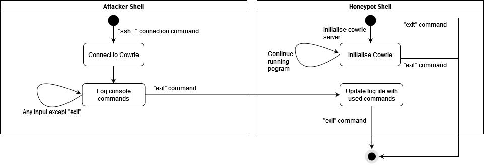
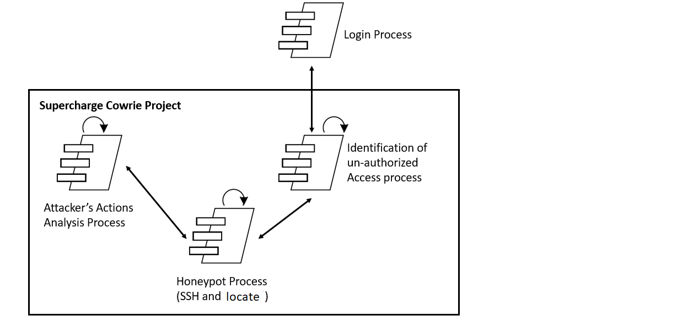

# ENGR 301 Project 03 Architectural Design and Proof-of-Concept

**Authors:** Lucy Carver, Sridhar Venkatesh, Thomas Yang, Selby Dasent, Shruti Raja, Deepika Raheja.

## 1. Introduction

The Supercharged Cowrie project is expected to expand the current capability of the Cowrie honeypot server, which is utilized to capture and document cyber attacks. The Cowrie system logs attackers' behaviour to help inform the user how to be better prepared for future attacks, when designing other systems.

### Client

Client Contact Details:  
Client:  Masood Mansoori, PhD. M.Sc. B.Sc.  
Email: masood.mansoori@vuw.ac.nz  
Work Phone: 04 886 5369  
University Office: CO 130, Cotton Building  

### 1.1 Purpose

The purpose of this project is to extend the functionality of the Cowrie system. The purpose of the extensions is to simulate functions of a real operating system, to entice cyber attacks and log the data generated by these attacks.

### 1.2 Scope

The scope of the Supercharged Cowrie project will be fairly elementary. The Client has stated they do not wish for a fully-fledged editor, with reliance on external libraries; but rather an editor that runs on basic script and can fulfill basic editing functionalities. These functionalities include typical commands that come with simulating an operating system, for example: nano, pwd, mkdir, whoami etc.

### 1.3 Changes to requirements

The original project requirements state that we will be implementing the 'whoami' command along with the editor. However, after considering the feedback provided from the client - it is not necessary to apply dynamic support/ouput of the 'whoami' command within the Cowrie honeypot. In place of this, it has been decided that dynamic implementation and support will be provided for the 'locate' command instead. Ensuring the current state of the minimum viable product will be as follows:

- Text Editor that allows for saving and editing files within the Cowrie file system
- Dynamic implementation for the 'locate' command

The locate command is used to search for files and directories by their names. The locate command will print the absolute path of all files and directories that matches the search pattern and for which the user has read permissions.

## 2. References

1. W. Cabral, C. Valli, L. Sikos and S. Wakeling, "Review and Analysis of Cowrie Artefacts and Their Potential to be Used Deceptively," 2019 International Conference on Computational Science and Computational Intelligence (CSCI), 2019, pp. 166-171, doi: 10.1109/CSCI49370.2019.00035.

2. Zealand, W., 2022. Offices.  WorkSafe. Available at: <https://www.worksafe.govt.nz/managing-health-and-safety/managing-risks/what-risk-looks-like-in-your-industry/office-workers> [Accessed 21 April 2022].

## 3. Architecture

### 3.1 Stakeholders

The following tables contain information regarding the stakeholders for this project and their concerns.
| Stakeholder  | Role |
| ------------- | ------------- |
| Team members  | Developing Cowrie |
| Masood Mansoori | Client |
| Project Manager  | Project Manager |
| Jesse Wood | Tutor |
| Winston Seah  | Owner |
| User  | Using end product |

| Stakeholder  | Main Concern |
| ------------- | ------------- |
| Team members  | Developing Cowrie to meet Client requirements on time  |
| Masood Mansoori  | Team producing the correct end product  |
| Project Manager  | Managing the team's communication and progress  |
| Jesse Wood  | Ensuring team is informed and aware of requirements  |
| Winston Seah  | Ensuring the team satisfies the client's requirements and expectations  |
| Users  |  Results of the final product  |

### 3.2 Architectural Viewpoints

**Physical Viewpoint:** Concerned with the topology of the systems components on the physical layer.  

**Logical Viewpoint:** Concerned with the abstracted funcionality of the system to the end users  

**Development Viewpoint:** Concerned with the this is about the development of the system from the programmers point of view.  

**Process Viewpoint:** Concerned with the run time processes of the system, and how these work together  

**Scenarios:** Using use cases to describe interactions with processes and objects. Use cases are important to help ensure the system will work upon completion.  

### 4. Architectural Views

### 4.1 Logical

### 4.1.1 State Flow diagram

To get a good understanding of our projects modular interactions, as well as how the user interacts with our program. A diagram, in this case, a state flow diagram will be used to show transitions between states. State flow diagrams consist of multiple states and transitions. States signify an event that occurs, sometimes, these events will contain internal activities that manipulate the data. These states are connected by transitions. Transitions are the "connection" between different states. These transitions will also have labels defining what conditions need to be met before the transition can occur. Figure 4.1.1.1 is a state flow diagram of our cowrie project.

The lefthand side of the diagram represents the attacker's starting input. In the initial state our attacker starts in the attacker shell. From there, the attacker connects to our cowrie server. From there, everything they type within the console is logged. This continues until the attacker exits from their shell, at which point, the log files in cowrie are updated.

The righthand side of the diragam represents the user's input. In the initial state the user starts in the cowrie shell. From there, the user initialises the cowrie server. This server continously runs until the exit command is given. The log files only ever update if there is an attacker present and they have connected, attempted any console commands, and then, disconnected from the cowrie server.

*Figure 4.1.1.1: State flow diagram.

### 4.1.2 Class Interaction Model

To further develop and understand the intricacies of the project, we will also use class interaction models. Similar to state flow diagrams, class interaction models delve deeper into class specific roles, this includes class specific methods, class attributes, and how each class interacts with its sub classes.

In our project, we have decided to pursue an MVC architecture. This is shown by the named frames marked "model", "view", and "controller". We also have an additional package present "commands" which stores the commands we will simulate the use of in our project.

### 4.1.2.1 Class Interaction Model Package

The model package will contain the "brains" of our program. This package holds the Editor_model class, Stored_object interface, and the Folder and File class. The Editor_model class stores the simulated files and folders of our cowrie system, as well as the current file being viewed. The model also has access to the commands package to ensure that model can implement commands that can change its files and folders.

### 4.1.2.2 Class Interaction View Package

The view package consists of the Editor class. This will be our text based editor as required by the client in our minimum viable product. The editor class consists of attributes to "draw" the text editor. This involves converting a file's contents and displaying it on the generated window. Drawing the cursor and displaying text when required according to the console commands implemented. Since the Editor class is solely responsible for drawing the text editor, changes to the appearance of the editor is calculated inside the Text_editor_controller class inside the Controller package.

### 4.1.2.3 Class Controller View Package

The controller package involves the Text_editor_controller class. This class invovlves calculating the changes to update our text editor. This is in comparison to the Editor class which is solely responsible for changing and drawing the text based editor. The controller package also is linked to the model package as access to number of files, file names current file, etc, are important when calculating changes in the text editor. 

### 4.1.2.4 Class Commands View Package

The commands package contains all the additional commands that will appear within our cowrie system. The commands package will contain the "Locate" class. This class represents are implmentation of the locate console command which returns the file path.

### 4.2 Development

The development view entails the system view from the programmers perspective. This represents the management revolving the software aspect of the Cowrie, and the reasoning behind these management decisions. This section consists of the following subsections

- Code Structure
- Version Control
- Testing
- Prototyping

### 4.2.1 Code Structure

- Forward arrows illustrate a dependancy - eg. Package1 -> Package2 means Package1 depends on Package2.
- Dashed lines illustrate modules within the package/directory in question
- Blue Rectangles illustrate directories/packages
- Green rectangles illustrate python modules

#### 4.2.1.1 Structure for Locate command

Considering there is already a source code/python module providing the implementation of basic Linux commands located within cowrie/src/cowrie/commands, the implementation of the locate command will be placed within this folder. The current version of Cowrie has python modules dedicated for the implementation of a command, to maintain consistency with the pre existing file structure for the source code in Cowrie, we will produce a locate.py file containing the implementation of the 'locate' command. 

#### 4.2.1.2 Structure for Text Editor

The source code for the text editor command will be located within the directory cowrie/src/cowrie/commands/TextEditor. We have been given approval to utilise the python library "curses" from the client/primary stakeholder, to provide further assistance on simulating a text-based terminal environment for the text editor.

Considering the text based terminal environment would emulate a Graphical-User-Interface, the Model-View-Controller (MVC) design pattern has been used to structure the python modules and place them in their respective packages. 

The "View" package will be responsible for providing a text based terminal environment for the user, and will contain most of the visual logic within the editor.py module, such as location of cursor, size of window and visible buttons/widgets to display the shortcuts that can be used when in the environment.

The "Controller" package is responsible for manipulating user input/commands and providing necessary input for the Model package (which will consist of all the editing logic/additional text editing functionalities). For example the "Controller" package is responsible for reading keyboard input from the user within the text environment to update the position of a cursor, along with reading keyboard shortcuts performed by the user to summon certain features with the editing environment eg. Save, Cut and Paste etc.  

The "Model" package is responsible for other additional functionalities for the text editor. Such as having modules to enable saving files, writing to files etc. 

Each of these packages have been separated into two layers to further identify what package is dependant on another package. This has been implemented with the design rule that packages should only be dependant on other packages that are either within the same layer or in a layer below, to ensure there are some constraints to our structure. Hence Controller and Model have been placed in Layer 1, where it's responsibility revolves around both interpreting user input and the overall logic of the editor. 

Layer 2 will contain code/implementation of the Text Editing environment, and is dependant on the current state of the editing logic that is within the Model package. 

*Figure 4.2.1.3 UML Package Diagram*

### 4.2.2 Version Control
To maintain good version control, we will be using Gitlab for this project. Gitlab allows us to use features such as branches, merge requests, issues and epics so that all team members can collaborate and contribute simultaneously while also keeping track of all changes and progress for the project. All project contributions on Gitlab will be done online. This means that all parts of the project will be backed up and easily accessible to team members at all times. 

We will be using branches on Gitlab for when different team members are working on different parts of the project. Each member will create and work on their own branch that will be created from the master branch. This will allow members to easily make contributions from their own devices at their convenience. Another benefit of using branches in Gitlab is that any branch containing mistakes or code with bugs will not be pushed onto the master branch, this means that members can experiment and try out different ways of completing their part of the project without worrying about any consequences it may have on already working part of the master branch. Once a member has finished with their branch, a merge request to the master branch will be committed. Another team member will review this merge request to check and approve it and will then merge it into the master branch.

Gitlab issues and epics will be used to break down the project into separate parts that team members will assign themselves to. This will allow us to keep track of the progress of the project by knowing what has been done, what is being done, and what is still left to do. Issues will also be used to discuss the implementation of ideas and elaborate on code implementations.

### 4.2.3 Testing
Our client has stated that they will be conducting the tests on our project once every two weeks during a meeting with all team members. The testing involves the client checking the accuracy of design and documentation as well as checking the correctness of the implementation and output. We will do this by using methods such as unit testing and acceptance testing. Walk-throughs and inspections will also be conducted for verification purposes. By using these methods, we can regularly ensure that we are meeting the clients expectations and we can receive feedback on what parts need improvements or changes made to them.  Walk throughs and inspections will allow us to discuss, explain and assess our individual contributions to the team and client. Team members, along with the client, can then make any suggestions and inspect specific parts that may need improving. Walkthrough and inspection meetings will involve the following procedure: Author (team member) explains what they have worked on, all other members inspect and point out any defects or possible improvements,  author makes changes according to what was inspected, changes will be checked at the next meeting. Everyone will get a turn to be the author. Consistent fortnightly meetings with the client and all team members will take place so that everyone is in agreement and is aware how the success of the project is tracking.

 Unit Testing will be frequently used to test parts of our implementation of the commands the client has asked for. Unit testing will essentially involve testing individual methods and making sure the method itself is correctly implemented and functions as expected. E.g  Testing a method for logins can check the user's credentials and will return true or false if they have logged in. The benefits of using unit testing is that it is time efficient, so it can be done often. 
 
 We will also be using acceptance testing. This will involve creating a set of tests that will ensure the team can produce the minimum viable product required by the client. (i.e text editor and locate command). These tests would involve ensuring that the text editor opens, and responds to the minimize or close button or, testing the locate command to ensure that it prints the correct file path etc. Acceptance testing will ensure that all the bare minimum functions work as expected to meet client requirements.

### 4.2.4 Prototyping
Our fortnightly meetings with the client will give us the chance to make small developments on prototypes of functional features and will also allow us to constantly provide updates and present these developments. This will be done using walk-throughs and inspections (refer to sub-section 4.2.3 above).  Doing this will keep the client informed on what has been completed and what still needs to be done or needs further attention. Our client will then have an opportunity to clarify and voice any feedback or opinions they may have so that changes can be made on prototypes early on.

### 4.3 Process

The process view underlines the interactions that are being performed from a user's perspective. Revealing how the system operates according to a user's request and the process it performs when providing a response to the user's request. An attacker will try to access the environment through using an SSH connection (on port 22), and this project will create a honeypot to monitor the system and study the behaviour of attackers. It will provide a simulated environment, where an attacker assumes that he is accessing a computer or server within a network environment. 

There are two scenarios when an attacker accesses the honeypot.

**First Time Attack:**

Whenever any attacker first time tries to access the honeypot. In this scenario, we can provide user a fresh environment and we don’t need to prepare too much for this. It would be the simplest solution.

**Returning Attack:**

In this scenario, an attacker comes back to exploits a system again then we need to make sure that:

1.	The attacker can see exactly the same changes to the file structure that he made in his previous session. Like create new folder, rename existing folder, delete any folder, create new file etc.
2.	Metadata (e.g., last modified owner, last modified files, last modified directories, last modified time etc) for files and directories should not be altered.
3.	There should not be noticeable delay in the response.
4.	The attacker should be able to see his all-historical commands as it is and in the same sequence, which he has performed by executing commands.
5.	There should not be any evidence where attacker should be able to observe that any commands has been replayed or re-executed.

Below diagram depicts the process architecture for Supercharged cowrie project

**Login Process:** It is an expternal process, and it is not part of our implementation. This step is just to show the starting point of the interaction.

**Identification of Un-authorised Access Process:** This process will check for all of the SSH accesses, if any authorized person will try to acceess the system then it will not forwaard the login (SSH) request to the honeypot. Only un-authorised SSH requests will be forwaarded to the honeypot system.

**Honeypot Process:** It will accpets the SSH request and keep track of all of the actions specified above.

**Attacker's Actions Anslysis Process:** This process will study the actions performed by the attacker, so that we can find out any vulnerabilities in our system and make it robust.

#### Non-functional Requirements:
Non functional requirements can be splitted into multiple categories, as described below:

**1. High performance:** 
Supercharged Cowrie system should respond quickly Whenever any attacker tried to login. 
Also, if there are multiple attacks on the same time then system must be able to tackle all of the requests.

**2. User friendly:** 
Attacker should not be able to identify that he is trapped with the honeypot.

**3. Security:** Supercharged cowrie project should be able to indentify authorised and un-authorised access effieciently and any un-authorised access should not be allowed to access actual system.

**4. Failure tolerance:** The system should be fail proof and be able to recover and keep
working in a matter of seconds.

**5. Multiple profiles support:** Supercharged Cowrie Porject should be able to support multiple profiles for various IoT devices.

### 4.4 Physical 

Cowrie has been built as a virtual honeypot. Therefore, there is very little in terms of physical requirements for the development of this project. It can be set up on any server or computer that has Python 3.7+ and Python-virtualenv installed and is connected to a network. Being a virual envroment that is ment to be attacked, any outside access to databases or backups pose a risk the attacker could access them outside of the controled enviroment. Therefore, project does not require a database to be set up or backup servers to be in place, figure 4.4.1 shows that only a network connection is required for the virtual enviroment to opperate.

*Figure 4.4.1: Physical blueprint*

The extensions that are being developed for Cowrie will utilise the same virtual environment that Cowrie is currently run within. This means that the extensions will use the systems and protocols within Cowrie to connect to a network and send and receive information. There are multiple areas within a network a honeypot should be set up as displayed in Figure 4.4.2. These include outside of the networks firewall, along side the service network servers and among the end users and main servers of the network. 
 

*Figure 4.4.2: Honeypot locations within a network*

### 4.5 Scenarios

The two main scenarios that have been highlighted, are Opening/Saving files using the text editor, and correct/dynamic output with regards to the "locate" command. Proper support for these two scenarios would ensure that our minimum viable product is completed.  

#### 4.5.1 Opening Files/Saving Files with the Text Editor

This scenario would also include use cases such as prompting a user to save the file they have made changes to, and prompting the user to rename the file if they please. 

**Actor**: Attacker  
**Actor's desire**: Attacker wants to be able to create script files and have them saved within the file system  
**Actor's reasoning**: To ensure that he/she is able to go back in the script and add content when necessary, eg. debugging the script by fixing code in the script, the actor wants to be able to save their progress to then be able to add content later.

**Acceptance Criteria**

1. User summons text environment with 'editor' command with a file
2. System opens text environment with the user's requested file opened
3. User adds content to the file and presses CTRL+X to save
4. Prompts user to rename and confirm they want to save
5. User responds with 'y' to the prompts
6. File is stored in the file system and system exits out of the text environment

*Figure 4.5.2 Scenario for Text Editor*

#### 4.5.3 User Executes Locate Command

This scenario has a very succinct process, as it is solely requiring the user to implement the command with a regex expression added onto it. For example expressions such as "*.sh" will allow the locate command to work with the expression to search through the file system for files with an extension of .sh. To avoid possible uncertainty - this will produce outputs of the absolute paths of these files in question, similar to how the 'locate' command operates in a Linux environment. 

**Actor**: Attacker  
**Actor's desires**: Attacker wants to use the locate command to spot any files with a particular extension eg. *.sh  
**Actor's reasoning**: Will allow attacker to keep track of the path of the scripts they are making.  

**Acceptance Criteria**

1. Attacker performs locate command with the regex expression *.sh to find all paths of their scripts
2. System parses through file system using string search, and prints out the absolute paths of the script files within the file system 

*Figure 4.5.4 Scenario for 'whoami' command*

## 5. Development Schedule

Subsection 5.1 has been modified from the project requirements. Extra information and justifications of the project deliverable dates have been added.

### 5.1 Schedule

The following are the key dates for the project deliverables. These dates have been comfirmed in advance with the client and the client has given approval via email for these dates.

1. July 31st - Architectural Prototype 
1. August 19th - Minimum Viable Product (Text editor and locate command)
1. October 1st - Further Releases (Extra commands that will be implemented after further discussions with the client once the minimum viable product has been completed).

These dates have been selected according to the size of the project, skillset of the team and the clients requirements. Along with these dates, we will be following the agile method and having sprints every two weeks. By breaking down the project into smaller, achievable tasks, we will be able to increase the overall productivity of the team. Sprints will also allow us to accomodate any change requests that may occur since we will have more control over the project.

### 5.2 Budget and Procurement

The Supercharged Cowrie project is software based, therefore we do not require any physical equipment or resources outside of our reach to complete it. Therefore this project does not have a budget.

### 5.3 Risks 

Risk: Tripping 
Likelihood: Likely 
Impact: Light - severe 
Can cause: Painful injuries resulting in members being unable to participate and contribute 
Mitigation: Ensure work areas and walkways are well-lit. Keep floor clear. Keep bags, cords etc under tables at all times. No running. Keep work area clutter free. 

Risk: Spending large amounts of time looking at the screen. 
Likelihood: Very likely 
Impact: Light - severe 
Can cause: headaches, blurry vision, dry eyes, and neck and shoulder pain 
Mitigation: Follow the 20-20-20 rule. Every 20 minutes look away from your screen and look at an object 20 feet away for at least 20 seconds. Practice regular breaks and avoid unnecessary screen use. 

Risk: Sitting at the desk for long periods of time. 
Likelihood: Very likely 
Impact: Moderate 
Can Cause: Bad posture, back pain. 
Mitigation: Educate members about their head position; try to keep the weight of the head directly above the neck. Encourage team members to take short walks

Risk: Papercuts 
Likelihood: Unlikely 
Impact: Light 
Can Cause: Bleeding, pain and discomfort 
Mitigation: Avoid using paper - it is not necessary for this project 

Risk: Lifting/carrying heavy items such as computer equipment or other personal belongings. 
Likelihood: Likely 
Impact: Moderate 
Can Cause: Injuries if something is dropped, muscle sprains and strains 
Mitigation: Position items so they are easily accessible for everyone. Provide assistance to members if required.[2] 

Risk: RSI (Repeated Strain Injury)  
Likelihood: Likely  
Impact: Moderate - Severe  
Can Cause: Long term pain doing day to day tasks, inability to do select tasks, expenses in the form of medical appointments, loss of quality of life, potential of injury in other tasks increases, permanent damage to muscles and ligaments, more likely to develop sciatica, more likely to develop carpal tunnel.  
Mitigation: Maintain a good posture whilst sitting at a desk. Frequent small breaks to stretch and readjust position at desk, and monitor posture. Take regular breaks while doing long and or repetitive tasks. If you are stressed, try breathing exercises, and focus on relaxing muscles to avoid strain and cramp. Unclench your jaw often to avoid pain there. Keep wrists flat and straight while writing. If pain is beginning to occur, do not ignore it, instead get up, move around, and make sure someone else in the team is aware that you may be in pain.  

Risk: Contracting Covid-19  
Likelihood: Very Likely  
Impact: Severe  
Can Cause: Widespread infection amongst the team, limiting ability to work on project. Can result in Long Covid in some individuals. Can also result in death if not treated properly.  
Mitigation: Wear masks at all times when social distancing is not possible, sanitize and wash hands before eating food, sanitize hands after coming into contact with door handles etc. Avoid touching each other (ie handshakes). Ensure that if you have symptoms of Covid-19 that you take a test immediately, and isolate and inform all team members immediately if the test is postive. If you test positive, follow all government and health instructions. Make sure to rest lots, and take breaks from screens. Do not push yourself to return to study, as pushing yourself too soon can increase the chance of developing long covid.  

Risk: Electrical Fires  
Likelihood: Unlikely  
Impact: Severe  
Can Cause: Burns, loss of equipment, loss of life, smoke inhalation, electrocution, damage to university property. 
Mitigation: Avoid overloading power points, ensure chargers and laptops are not being used on flammable surfaces, and monitor chargers, phones and laptops for overheating. Particularly those with metal framed laptops, monitor the health of the device, and the heat it is putting out. Familiarise selves with nearest C02 fire extinguisher (Carbon Dioxide extinguisher), and/or the nearest Dry Powder extinguisher. If an electrical fire is to occur, locate the nearest C02 or Dry Powder extinguisher, and follow instructions on the extinguisher. Ensure that someone on the team activates the nearest fire alarm. DO NOT USE WATER ON AN ELECTRICAL FIRE.  

Risk: Spillage of food & liquids  
Likelihood: Likely  
Impact: Moderate  
Can Cause: Damage to computers, sticky mess to clean up, slipping hazard, damage to university property, reduction in teams ability to work on project, damage to hard drives, loss of progress, electrical failures.  
Mitigation: No food near computers. Only drinks in sealed, spillproof containers. Only have water in a sealed spill proof bottle in the laboratories. If spillage does occur, ensure it is cleaned up immediately, and notify other team members of the spill. If possible, find a wet floor sign to put up near the spill, to avoid other people slipping. 

Risk: Stress/Arguments/Anger/Disagreements within the team.  
Likelihood: Very Likely  
Impact: Severe  
Can Cause: Physical confrontation amongst team members, hostility and emotional distress, inability to complete work as a team, a flawed end product, lasting resentment towards team members after the project has ended. Can damage team relationships, and  affect individual and team grades. Hostility between team members in front of client can jeopardise clients perception of the team.  
Mitigation: Be mindful of the way team interacts - mindful of body language, tone, and facial expressions. If tension is brewing, make sure to take a breather from working with whoever the tension is with, and step outside. Do nottry and resolve conflicts whilst emotional. If a problem occurs, let the team know, as it is important to resolve conflict before it escalates. Maintain good communication with the team. Be mindful of interactions around deadlines, as all team members will be feeling tense close to deadlines. Maintain clear and consistent communication in the lead up to any and all deadlines. If conflict cannot be resolved one to one with team mates, escalate up the hierachy to the team tutor, and further if needed. Best way to mitigate problems is to solve them as soon as they occur - do not allow conflict to fester and grow. 

### 5.4 Health and Safety

The team will manage computer related risks by following the mitigation strategies listed in the section above. To manage Occupational Over Use, team members will be aware to stop when they have any sort of disomfort, and take frequent breaks to adjust posture and hand placement. The team will be made aware of the correct positions for hands while typing, and correct posture for working at a desk. Frequent breaks will be the best way to manage risks of Occupational Over Use. 
The team will manage cables by ensuring that powerpoints are not overloaded, and computer charging cables are laid out in such a way that tangles should not happen. In the laboratories computer cables will be placed along places that are there to leave cables in. In the event that a team member needs an extra cable to be plugged into something, the team member will ensure that there is enough space in the plug socket without overloading it, and make sure that the cable is laid out correctly to ensure that the cables are managed correctly. 

The project does not require work or testing at any external workplaces or sites. All work is software based, and will take place in either the university computer laboratories, university libraries, university campus seating, or at the team members own place of residence. All team members will adhere to the university computer safety requirements while on campus, and adhere to safety guidelines around computer use when working at their own place of residence. 

The project does not require and human or animal testing. All software testing will be done within the team by the team members, and does not require Ethics Approval. 

For the duration of this project, the team is required to adhere to all university policies, government laws, and Covid-19 health orders. It is the responsibility of each team member to read through the possible risks of this project, and familiarise themselves with the mitigation strategies listed. The list of risk and mitigation strategies may not be inclusive, and all team members are encouraged to add to the list as they see fit.

#### 5.4.1 Safety Plans

Project requirements do not involve risk of death, serious harm, harm or injury

## 6. Appendices

### 6.1 Assumptions and dependencies 

Supercharged Cowrie Project has below listed Assumptions and dependancies

#### Assumptions:
1. Port (22) is enabled for SSH login.
1. "admin" user has permission to do SSH login.
1. Allwed to use basic linux commands, like: nano editor, pwd, whoami
1. "locate" command is executable and returns expected outcome.
1. "userdb.txt" file content format would be "<USER_NAME>:<UESR_PASSWORD>"
1. Screen size/format would be as per the standard linux editors.
1. File editiing commands will be stored in a log file and its name will be Cowrie.log
1. Location of the "Cowrie.log" file will be /cowrie/var/cowrie.
1. Doesn't have specific hardware requirements.
1. Only file system will be used to store information rather than using any SQL (like MySQL, SQL Server etc.) or Non-SQL (Like: MongoDB, DyanmoDB etc.) database.
1. Customization would be required only for 'locate' and 'nano' text editor in this project.

#### Dependancies:
1. Availability of Source code for 'Cowrie Honeypot Server' project for extension and enhancements.
1. Knowledge of the python language would be required. 
1. Location of the various log files would be dependent on the source code for 'Cowrie' Project.

### 6.2 Acronyms and abbreviations

Here is the list of Acronyms and abbreviations used in this document.

#### List of Acronyms

|Acronym  |	Category/ stands for |
|---------|----------------------|
|CEF | Common Event Format (Used for loggiing) |
|CLI | Command Line Interface |
|e.g. | Latin abbreviations |
|ECS | Engineering Computer Science |
|ENGR301 | Course Code used in Victoria University for Engineering stream. |
|Kbs | Knowledge based system |
|ssh or SSH | Secure Shell used for remote login to the linux server |
|UML | Unified Modeling Language |

#### List of abbreviations

|Abbreviation  | Stands/Used for |
|---------|----------------------|
|etc.|et cetera (means and so on)|
|i.e.|Id est (means that is) Used to clarify or specify something in parentheses|
|mkdir| Linux command to create new directoty |
|sync|Synchronization, synchronize| 
|nano| Linux Text Editor |
|Locate| command to retrieve absolute path of files satisfying a regex expression inputted by the user|

## 7. Contributions

Lucy Carver: 5.3 (risks 6-10 inclusive), 5.4, 5.4.1, 3.2  
Sridhar Venkatesh: 4.2.1, 4.2.1.1, 4.2.1.2 including code structure diagram, All of section 4.5 including diagrams  
Thomas Yang: 4.1.1, 4.1.2, 4.1.2.1, 4.1.2.2, 4.1.2.3, 4.1.2.4 
Selby Dasent: 4.4, Editing 
Shruti Raja: 1.3, 3.1, 4.2.2, 4.2.3, 4.2.4, 5.1, 5.2, 5.3 (risks 1-5 inclusive)  
Deepika Raheja: 4.3, 6

---

