# ENGR 301: Project Requirements Document

# ENGR 301 Project Supercharged Cowrie Project Proposal and Requirements Document
#### Lucy Carver, Sridhar Venkatesh, Thomas Yang, Shruti Raja, Selby Dasent, Deepika Raheja

## 1. Introduction

The Supercharged Cowrie project is expected to expand the current capability of the Cowrie honeypot server, which is utilized to bait cyber attacks. The Cowrie system logs attackers' behaviour to help inform the user how to be better prepared for future attacks, when designing other systems. 

### Client

Client:  Masood Mansoori, PhD. M.Sc. B.Sc.  
Contact Details:  
Email: masood.mansoori@vuw.ac.nz  
Work Phone: 04 886 5369  
University Office: CO 130, Cotton Building 

### 1.1 Purpose

The purpose of this project is to extend the functionality of the Cowrie system. The purpose of the extensions is to simulate functions of a real operating system, to entice cyber attacks and log the data generated by these attacks. 

### 1.2 Scope

The scope of the Supercharged Cowrie system will be fairly elementary. The Client has stated they do not wish for a fully-fledged editor, with reliance on external libraries; but rather an editor that runs on basic script and can fulfill basic editing functionalities. These functionalities include typical commands taht come with simulating an operating system, for example: nano, pwd, mkdir, whoami etc.

### 1.3 Product Overview 
#### 1.3.1 Product Perspective

Cowrie is a medium level interaction honeypot server, derived from Kippo. Kippo was another medium level interaction server developed with Python, which was primarily used to log brute force attacks and any sort of shell interaction performed by the attacker. Similar to Cowrie, Kippo also presents a fake file system for the attacker to work with. Along with a fake file system, Kippo also provides a file named userdb.txt, which allows the user of Kippo to edit any possible password and username combinations for the attacker to work with. This file can be overwritten and added to when necessary. The commands performed by an attacker (when logged into Kippo) are immediately captured and saved into a log file. Kippo also presents the utility to replay these log files at the live speed in which they were performed by the attacker.  

Kippo is no longer under active development, and most of its file structure, functionality and library dependancies have been utilised for the implementation of Cowrie. Cowrie is considered an extension of the functionalities of Kippo, as it is more capable of emulating the functionalities of an operating system and supports a wider range of commands. 

The Supercharged Cowrie project plans to implement specific commands and ensure that the Cowrie is able to provide dynamic output for those possible commands that an attacker may perform. Specifically the whoami command and the ability to provide a command line text editor that runs from its own script. The whoami command needs to produce expected results depending on whoever the attacker is logged in as. It is expected to create support for a text editor that runs from no library dependancies and is able to emulate the functionality of the nano editor (currently in Linux CLIs), while running off its own independant script. 

**User interfaces:** 

Operates within the command line interface. This should allow for editing files within the command line for Windows and Unix certified systems. 

**CPU/Memory**

Memory usage has not been documented as of yet, however there is an existence of a meminfo file, to allow the attacker to monitor how the memory is being used whilst logged into Cowrie. Cowrie simulates the internal storage of different IoT devices to further enhance its simulation of the internal, configuration files and file structure. When an attacker wants to read the meminfo file, they will be provided with memory storage/CPU/OS from the IoT devices that have been simulated for Cowrie. Memory should be persistent to the extent that an attacker will be able to view a history of their previous commands performed whilst logged into Cowrie. There should also be (at least) metadata of the files that were created in the last session where the attacker previously logged on and there should be some trace of the data that was created by the attacker while logged into the honeypot. 

#### 1.3.2 Product Functions

Cowrie currently has a number of features that allow it to operate as a honeypot. The Supercharged Cowrie project will be expanding on these to improve its functionality. These functions will build off existing commands and utilities within a Unix system but be created to operate within Cowrie.

The first function will be a dynamic whoami command. This is a basic Unix and Windows command that is used within the CLI to display the username of who is logged in. Cowrie does currently have a response to the whoami command; however this command has a fixed response of root. To make this a dynamic response rather than a static response, the command will need to produce a response based off the username of who is logged in. This will improve the deceptiveness of the Cowrie honeypot for those that log into it. 

The second function that will be added is that of a CLI text editor. A common tactic for attackers when accessing a system is to open a text editor and edit/save a file, if the system does not behave as expected then the attacker may be tipped off that they are in a honeypot.  

The text editor should provide an environment like that of Nano. A list of features within Nano are as follows:
-	**Exit** This will prompt the user to save the document and provide the option to change the name of the document and once saved it will exit nano.
-	**Write Out** This saves the file, the file must be saved with the correct permissions based off the user permissions. This also prompts the user to name the file that is being saved. The text box will have the current file name if there is one and ask the user to confirm if they want to change it from the original. 
-	**Read File** This allows the user to open a file and load the text content into the editor.
-	**Where is** This allows the user to find a string within the document.
-	**Replace** This finds and replaces a string with another string.
-	**Cut** This copies a highlighted string and remove the text from the screen. 
-	**Paste** This pastes a cut or copied string at the position of the curser.

The user experience and interface within the text editor needs to mimic Nano, this includes a highlighted dynamic output at the bottom of the screen. This will need to provide information of how many lines are in the document when it is opened. 

#### 1.3.3 User Characteristics   

The Cowrie honeypot system is designed to capture SSH and Telnet connections, as well as record the session information. Cowrie is primarily used by researchers, however Cowrie can be used by individuals or companies that need to track real-time hacking attempts. Researchers are interested in Cowrie because it is seen as a valuable security technique that can be implemented to mitigate attacks and it also provides an opportunity to learn more detail about the nature of these attacks. Researchers can then examine these interactions to learn about new tools, tactics, and processes used by attackers. This resulting analysis then helps them create actionable cybersecurity intelligence and then remediate and secure the information security of the infrastructure. Hackers may also use Cowrie on other hackers, hoping adversaries will accidentally leak data that identifies them. Government agencies, law enforcement and defense networks can use Cowrie to create a trap for hostile hackers and get them to reveal their techniques.   
Another use of Cowrie for researchers is a tool to gather data about attacks. For example, the lessons learned from the attacks can be used to build even better or stronger defense mechanisms to improve security.
This knowledge can also be used to improve other honeypots or the system itself. In addition, new systems other than honeypots may be developed in future using this knowledge. Research helps to increase our understanding of deception techniques and can be used as a pivot for planning, configuring, and testing the default Cowrie configuration file to increase its deceptive capabilities when presented to attackers.
The use of honeypots such as Cowrie is becoming increasingly more common in terms of studying how attackers penetrate into information security systems. From this, researchers can learn and analyze new threats and attack methodologies to counter and defend ourselves from cyber-attackers.

#### 1.3.4 Limitations

The Cowrie honeypot is a helpful tool for observing the attackers behavior, but it has some areas that need improvement, which are listed below.

**a) Lack of a persistent filesystem:** The Cowrie honeypot has issues with the maintaining changes into the file system for an individual. When an attacker tries to make changes to the file system, such as adding and removing any folders, files, or directories a good honeypot should be able to maintain that information, so that the attacker will be able to see these changes. A lack of changes to this system will indicate to the attacker that they are in a honeypot. Cowrie should also maintain metadata of the file system such as: last modified date, last modified by, owner of the file or directory - this information should remain the same.

**b) Default state of Cowrie honeypot is easily finger printable:** The Cowrie honeypot is currently unable to be easily customised by the user, meaning the attackers can discover the honeypot.

**c) Cowrie has a limited range of realistic IoT device profiles:** IoT devices are favourable tools for the attackers as there are greater chances that these are not configured properly. Cowrie has limited realistic profiles for the IoT devices, which makes it easily finger printable.

**d) Limited Documentation:** As it is an open source project and it is not maintained by a dedicated team, there is a lack of documentation. Whenever anyone makes changes to its source code, there is a high chance that it may not have gone through the quality assurance process. This makes it difficult for new developers to edit and contribute to the code, as there is a severe lack of documentation.

**e) Source Code Complexity:** Since the start of the project more than 100 developers have contributed to the original Cowrie project. Due to lack of the co-ordination of these developers, over time an unnecessary level of complexity has been introduced. 

## 2. References

References to other documents or standards. Follow the IEEE Citation  Reference scheme, available from the [IEEE website](https://www.ieee.org/) (please use the search box). (1 page, longer if required)

## 3. Specific requirements  

20 pages outlining the requirements of the system. You should apportion these pages across the following subsections to focus on the most important parts of your product.

### 3.1 External interfaces

#### Interface 1 : Command Line Interface

The purpose of this interface is to ensure that the user is within a UNIX environment to ensure they can perform certain linux commands such as nano (or some command to summon a text editor) and whoami. This is the sole interface where both input and output can be retirieved. 

The source of input through this interface will come through the users end when they connect through to the Cowrie Honeypot, to prevent usability issues with the user, the responses will be delivered to the same terminal window as the user, such as the theme for most honeypot servers. 

Outputs delivered for the whoami and text editor commands should be dynamic and should be responsive and adaptive to the current user state of the Cowrie. The text editor environment should be summoned for inputs such as (nano [filename]) to edit a file straight from the terminal. As well as have support for input commands such as (nano) which will solely bring up the text editing environment for the user to select or create files with names of their choice. For the whoami command, valid inputs from the user would strictly be confined to "whoami" as this is the case for a normal UNIX/Linux environment. Valid output would guarantee a username, as the user would most likely at the leas perform this command after they have logged into the Cowrie honeypot. Source of the output will be located in the config file and the system should at least print out the ocrrect username based off the current state of the Cowrie. 

The timing of responses for the inputs should be around 5 seconds at most, particularly for loading up the text editing environment such as Nano. Functionalities within the text editor should be performed within a second of being called by the user. As for the whoami command, searching through the userdb.txt file and fetching the latest username, this process of gathering the output should be performed within a second of being called as well. 

The way user data will be formatted such as username and password, will be separated by a ":" character. For example within the configured for us userdb.txt all the entries follow a set structure following username:x:password, the value "x" is an abitrary value and is not considered for when we parse the values to retrieve the username from a line. 

The screen size/format would follow that of a normal linux terminal window.

End messages will only be delivered to the user if they somehow mistype one of the commands (whoami or nano/text editor). For example ' 'whoiam' is not a recognised command'

### 3.2 Functions

#### Use Case 1: User executes whoami command to see which user they are logged in as

The first priority in terms of development would be to apply dynamic output to the whoami command, dependent upon who the user is currently logged in as. This would be first priority in terms of development as functionality of the whoami command will aid in developing a fully fledged text editor that operates dynamically depending upon the permissions enabled on a file. 

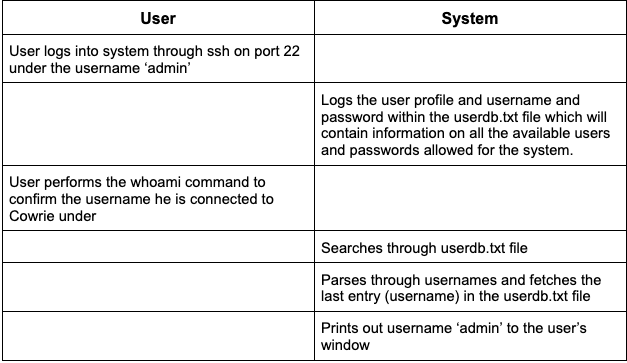

#### Use Case 2: User executes text editor command to summon text editor to edit a file

Once the whoami command has been implemented and ensured that the Cowrie honeypot has support for it, we plan to start implementing basic functionality for the text editor. For example, ensuring that some text editing environment (similar to that of nano) opens up once the user executes the command. 

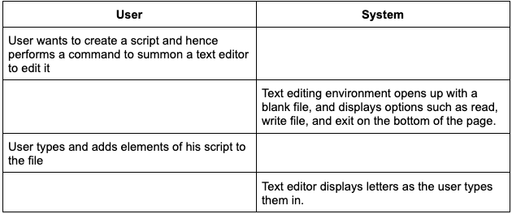

#### Use Case 3: User attempts to edit a file and save the progress they have made

After providing support for the basic editing functionality, the next step would be to ensure that there is persistence for edited files. We need to implement some level of saving functionality to allow the user to continue upon the progress they have already made previously within a file. 

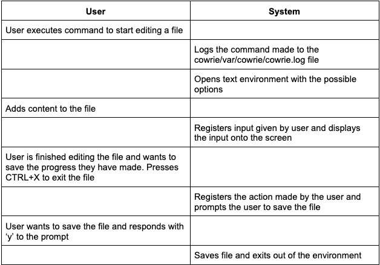

#### Use Case 4: User uses Write Out option on an edited file

Similar to the exit functionality, the Write Out option also allows for an option to save before the action is completed, also with an additional option to rename the file if needed, however this allows the user to continue with their progress on a file. We also need to ensure with saving files that we also assign correct permissions to files that are being saved, eg. Owner permissions, group permissions, other permissions etc.

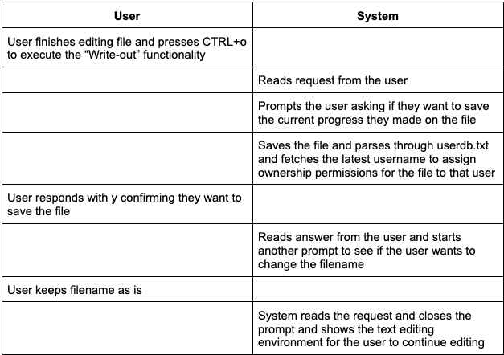

#### Use Case 5: User uses Write Out option on an edited file

This functionality allows a user to open an already existing file within the text editing environment to continue their progress on that file.

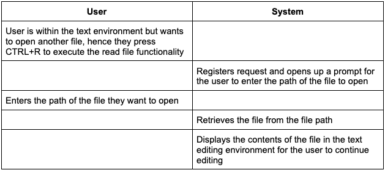

#### Use Case 6: User wants to search for a string within a file

We also want to allow for the functionality to find and search if a certain string exists within a files contents

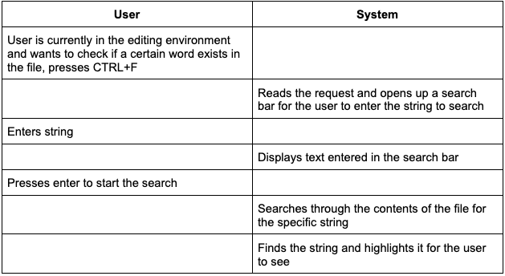

#### Use Case 7: User wants to replace all occurrences of a string with another string in a file

Along with implementing a find functionality within our text editing environment. It is imperative that along with that a find and replace functionality is also implemented and available to the user. 

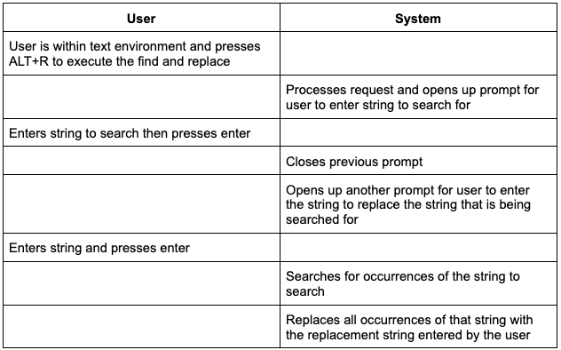

#### Use Case 8: User wants to cut/delete whole lines within a file 

To almost complete a minimum viable text editor support for the Cowrie. It is also important that we provide support for mass deletion within the text editing environment, for example allowing a user to delete a whole line of text in their file.

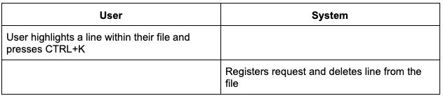

#### Use Case 9: User wants to paste text into their file

Our final feature for our text editor is to add some level of support for pasting content from other files into the text editing environment for the user, ensuring that the text editor we provide for the Cowrie includes all the functionalities of a normal text editor.

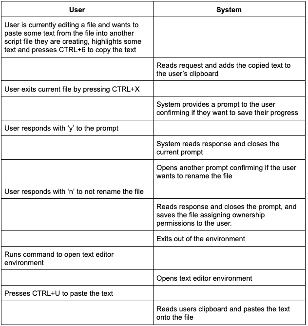

### 3.3 Usability Requirements

Requirements for the functionality of a text editor within the CLI are as follows. The makings of a satisfactory text editor should mimic efficiency levels to that of the nano command when editing files within the terminal. For example options such as Read File, Write File, Exit, Cut and Paste need to be displayed clearly on the screen to be visible for the user. These sort of functions within the text editor need to have support for keyboard shortcuts to ensure the efficiency levels provided by the nano text editor are also emulated by our newly implemented text editor. For example, if an attacker accidentally enters in the command to execute the text editor to edit a file, they should be provided with the option to quickly exit the file with CTRL+X and proceed upon their intentions.

Permissions to edit files and save them should be properly reflected when an attacker tries to edit a file. For example, nano when editing a file can also let the user know whenever a file is read only or not. Henceforth we plan to implement a text editor that is reflective of permissions enabled on a file, to not permanent changes to be made to a file regardless of the permissions enabled on a specific file. Concrete and clear error messages should be displayed to the user when attempting to edit a read-only file for example, with Nano it cearly displays upon the bottom of the file that the user is editing a read-only file, and this message is highlighted in orange. Making sure the user is immediately aware of the permissions enabled on the file that they are editing. 

Requirements that are in place to ensure satisfactory output for the whoami command for Cowrie are as follows. The Cowrie should keep a log of all commands executed by the attacker whether they are supported or not, this should also log the user that the attacker is currently logged in as at that point of time. The whoami command should accurately print out the username/alias that the attacker has decided to go by. There aren't many usages or functionalities to do with the whoami command, however it is imperative for our iteration of the Cowrie honeypot that the whoami can dynamically represent the current use state of the cowrie.

### 3.4 Performance requirements

**3.4.1 whoami Response Time**

The whoami command shall display response within 0.5 seconds of being called.

**3.4.2 Nano Response time**

The Nano software shall display the user interface within 0.5 seconds of being called.

The Nano software shall open and display an existing file within 1 second of being called.

The write out function shall write the file to memory within 1 second of being called.

The exit function shall exit the application and return to the CLI within 0.5 seconds of being called.

The where function shall find a string within 1 second of being called.

The replace function shall replace a string within 0.5 seconds of being called.

The cut function shall remove the string and store the string within 0.5 seconds of being called.

The paste function shall write the stored string within 0.5 seconds of being called.

**3.4.3 Nano Document Size**

The Nano software shall handle *kbs of data when loading an existing file.

The Nano software shall handle *kbs of data when saving to an existing file.

The Nano software shall handle *kbs of data when saving to a new file.

### 3.5 Logical database requirements

The data base for Cowrie is set to represent a standard file system. Any files the attacker saves through Nano are to be stored within cowires downloads folder. All executed commands are to be saved in the cowrie.json file and all system messages are to be saved in the cowrie.log file. 

The attackers files are to be saved as a standard file in the location they executed nano. Any files the attacker will open with Nano are stored where the command is executed. This will follow the current event format that cowrie has in place for processing and storing information.

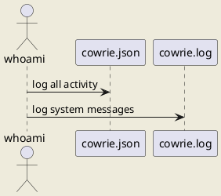

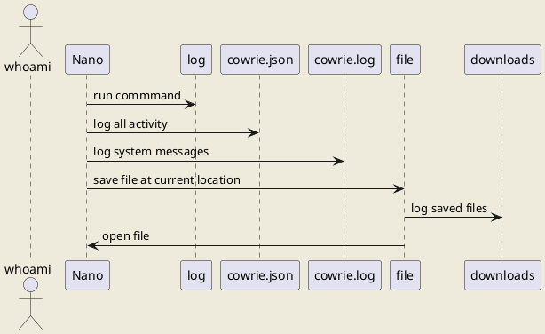

### 3.6 Design constraints

**Python3**

Python3 is an unfamiliar language with several of the team, most members coding experience has been focused on Java. This is a major constraint as users will be having to learn python while developing the program.

**Expanding an existing system**

Cowrie is already an operational piece of software. The project team will have to familiarise themselves with the current software and how to add modules to it. The system already has features and processes in place that the team must adhere to. 

**Timeframe**

Deadlines and timeframes will pose constraints on this project. Team members have other commitments such as work and other university courses that could have conflicting deadlines. There is also the risk of illness caused by but not limited to covid. This could have team members unable to perform their assigned tasks. 

### 3.7 Nonfunctional system attributes

#### Security

For the purpose of enhancing the Cowrie, by default the Cowrie already has mechanisms in place to log the commands performed by an attacker into log files following the CEF (Common Event Format). It already has designs in place to store newly created files by an attacker within the fake file system, considering the Cowrie designs the fake-file system from its own end, it is possible for us to search through the files an attacker creates, in case they create a malicious script. We have access to any actions or any content the user provides already with the mechanisms in place from the sydtem we are enhancing

#### Availability

The text editing environment should be available to the user regardless of the faults that may occur. For example a user may accidentally forget to add a filename to the end of their nano command to directly open a file in the text editor, we allow for such situations through the functionality of the read-file shortcut that can be done whilst in the editing environment. If a user possibly wants to exit a file, under all circumstances of when a user wants to exit a file, they should be prompted to confirm if they want to save the file or rename the file. If a fault happens even under those circumstances, for example a user accidentally exits without saving an edited file, we should provide no recovering ability for those files as this helps to further simulate the nuances of an actual linux system/environment. We provide prompts to ensure a user will remember to save their files before exiting them, thus the chance of this happening is very small. 

Also for recovering possible faults for the whoami command, this can only be managed by providing a possible end message if the command performed by the user is not correct, to ensure the user types in the command correctly. We will implement it this way as this tends to be how Linux systems respond to unrecognised commands. 

#### Portability

Our interation of the Cowrie provides support for a wider range of linux commands. Hence it is preferred that usage and testing of our enhancement of the Cowrie honeypot is done under a UNIX environment. 

### 3.8 Physical and Environmental Requirements 

There are no physical hardware components associated with this project. Basic environmental requirements solely consist of simple internet connection. 

### 3.9 Supporting information

Their is no sypporting information for this project.

## 4. Verification

There is currently two main requirements dictated by the client. These are whoami, and the text editor. An important characterstic to note about verification is that verification is static test, as opposed to the validation phase which contains dynamic testing of the code base. The overall objective of verification is to ensure that the documentation and design meet the specificed requirements outlined and fulfil the clients needs. Successful implementation of these requirements will be dependent on each requirement passing multiple verification methods listed below.

- Walk-throughs
- Inspections

**4.1 Walk-throughs**

Walk-throughs is verifcations technique which involves a presenter whom covers the project's overall functionality as well as documentation. The presenter is encouraged to explain the functionality using additional presentation aids such as: use cases, user stories diagrams, functional decomposition diagrams etc. Attendees will follow along the presentation and are encouraged to discuss or clarify specific functionalities of the program. Attendees are not required to prepare anything. Ultimately, the purpose of this method is to ensure that faults about the program design and/or documentation is highlighted and fixed before we reach the development stage of the program. This method is also useful for ensuring each of the attendees has a thorough understanding of the documentation so group members are in sync with one another.

In terms of the use of walk-throughs more specifically in the cowrie project. Walk-throughs will be conducted once a fortnight to ensure that development of the design and documentation continues to follow and does not impede the client's most important requirements. In this case, whoami and the text editor. Use cases for the expected funcationality of the program have already been designed (see section 3.2), to ensure that the overall design of the program is correct. For the text editor, a user story diagram would be useful in highlighting the interaction between the user and the cowrie system. This way we also get a better understanding of the interaction between functions within our system and how they should all behave and relate to one another. Building off the user story diagrams, a function decompoisition diagram can be created to further explore each function in detail. This will highlight the roles each functions plays and whether they are adequate or require sub functions to ensure the systsm runs smoothly. These diagrams and use cases should continue to be added upon where necessary to ensure they reflect the documentation and design at that current stage of development. Another possible aspect is that we can also include our client in the walk-throughs meeting. This ensures that there is no ambiguity between what the client wants, and what we will design.

**4.2 Inspections**

Inspections require the attendees to be active and have prior knowledge of the design and documentation. From here, a neutral party will run the forum where attendees are to voice their opinions in regards to important areas of design and documentation, as well as any opinion on potiential faults or bugs that may occur. After the discussion is concluded, a report is written up containing all that was discussed in the meeting and the neutral moderator provides the final say on necessary ammendments to the development. The strength of inspections over walk-throughs is due to the nature of the discussion, in that is not lead by a single presenter, there is no biased as to what specific aspects of the documentation and/or design is discussed during the meeting. This ensures that all aspects of the program is covered as opposed to a small section of the program.

The use of inspections should be limited in our cowrie project. While inspections is a powerful verification method, inspections are often time consuming and therefore should only be done when necessary. In this case, once in three weeks. The fortnightly walk-throughs meeting should ideally capture most of faults that occur in documentation or design, therefore the inspection should only really act as a guarntee to ensure the cowrie system is on track to fulfilling the requirements and the clients needs. As for the neutral party during the meetings, we can rotate around to a recorder whom records and decides what changes, if any, are required and can write the report after the meeting.

## 5. Development schedule.

### 5.1 Schedule

Identify dates for key project deliverables: 

1. July 31st - Architectural Prototype 
1. August 19th - Minimum Viable Product
1. October 1st - Further Releases

### 5.2 Budget

Since our project is software based, we do not require any physical equipment or resources outside of our reach to complete it. Therefore this project does not have a budget. 

### 5.3 Risks 

Risks  done by Shruti  
 
Risk: Tripping, slipping, falling  
Likelihood: Likely  
Impact: Light - severe  
Can cause: Painful injuries resulting in members being unable to participate and contribute  
Mitigation: Clean any spills immediately and dry the floor.
Ensure work areas and walkways are well-lit. Keep floor clear. Keep bags, cords etc under tables at all times. No running. Keep work area clutter free.  
 
Risk: Spending large amounts of time looking at the screen.  
Likelihood: Very likely  
Impact: Light - severe   
Can cause: headaches, blurry vision, dry eyes, and neck and shoulder pain  
Mitigation: Follow the 20-20-20 rule. Every 20 minutes look away from your screen and look at an object 20 feet away for at least 20 seconds. Practice regular breaks and avoid unnecessary screen use.  
 
Risk: Sitting at the desk for long periods of time.  
Likelihood: Very likely  
Impact: Moderate  
Can Cause: Team members may spend a lot of time doing work seated at a desk, using a computer. As a result they are prone to strains and other injuries related to posture. This can also cause back pain, sleepiness and other issues later on.  
Mitigation: Educate members about their head position; try to keep the weight of the head directly above the neck.
Encourage members not to slouch when sitting at a desk. Take regular breaks, go for short walks outside and try stay active  
 
Risk: Papercuts  
Likelihood: Unlikely  
Impact: Light  
Can Cause: Bleeding, pain and discomfort  
Mitigation: Avoid using paper - it is not necessary for this project  
 
Risk: Lifting/carrying heavy items such as computer equipment or other personal belongings.  
Likelihood: Likely  
Impact: Moderate  
Can Cause: Injuries if something is dropped, muscle sprains and strains  
Mitigation: Position items so they are easily accessible for everyone. Provide assistance to members if required.  
 
Risks done by Lucy  
 
Risk: RSI (Repeated Strain Injury)  
Likelihood: Likely  
Impact: Moderate - Severe  
Can Cause: Long term pain doing day to day tasks, inability to do select tasks, expenses in the form of medical appointments, loss of quality of life, potential of injury in other tasks increases, permanent damage to muscles and ligaments, more likely to develop sciatica, more likely to develop carpal tunnel.  
Mitigation: Maintain a good posture whilst sitting at a desk. Frequent small breaks to stretch and readjust position at desk, and monitor posture. Take regular breaks while doing long and or repetitive tasks. If you are stressed, try breathing exercises, and focus on relaxing muscles to avoid strain and cramp. Unclench your jaw often to avoid pain there. Keep wrists flat and straight while writing. If pain is beginning to occur, do not ignore it, instead get up, move around, and make sure someone else in the team is aware that you may be in pain.  
 
Risk: Contracting Covid-19  
Likelihood: Very Likely  
Impact: Severe  
Can Cause: Widespread infection amongst the team, limiting ability to work on project. Can result in Long Covid in some individuals. Can also result in death if not treated properly.  
Mitigation: Wear masks at all times when social distancing is not possible, sanitize and wash hands before eating food, sanitize hands after coming into contact with door handles etc. Avoid touching each other (ie handshakes). Ensure that if you have symptoms of Covid-19 that you take a test immediately, and isolate and inform all team members immediately if the test is postive. If you test positive, follow all government and health instructions. Make sure to rest lots, and take breaks from screens. Do not push yourself to return to study, as pushing yourself too soon can increase the chance of developing long covid.  
 
Risk: Electrical Fires  
Likelihood: Unlikely  
Impact: Severe  
Can Cause: Burns, loss of equipment, loss of life, smoke inhalation, electrocution, damage to university property. 
Mitigation: Avoid overloading power points, ensure chargers and laptops are not being used on flammable surfaces, and monitor chargers, phones and laptops for overheating. Particularly those with metal framed laptops, monitor the health of the device, and the heat it is putting out. Familiarise selves with nearest C02 fire extinguisher (Carbon Dioxide extinguisher). If an electrical fire is to occur, locate nearest C02 extinguisher, and follow instructions on the extinguisher. Ensure that someone on the team activates the nearest fire alarm. DO NO USE WATER ON AN ELECTRICAL FIRE.  
 
Risk: Spillage of food & liquids  
Likelihood: Likely  
Impact: Moderate  
Can Cause: Damage to computers, sticky mess to clean up, slipping hazard, damage to university property, reduction in teams ability to work on project, damage to hard drives, loss of progress, electrical failures.  
Mitigation: No food near computers. Only drinks in sealed, spillproof containers. Only have water in a sealed spill proof bottle in the laboratories. If spillage does occur, ensure it is cleaned up immediately, and notify other team members of the spill. If possible, find a wet floor sign to put up near the spill, to avoid other people slipping. 
 
Risk: Stress/Arguments/Anger/Disagreements within the team.  
Likelihood: Very Likely  
Impact: Severe  
Can Cause: Physical confrontation amongst team members, hostility and emotional distress, inability to complete work as a team, a flawed end product, lasting resentment towards team members after the project has ended. Can damage team relationships, and  affect individual and team grades. Hostility between team members in front of client can jeopardise clients perception of the team.  
Mitigation: Be mindful of the way team interacts - mindful of body language, tone, and facial expressions. If tension is brewing, make sure to take a breather from working with whoever the tension is with, and step outside. Do nottry and resolve conflicts whilst emotional. If a problem occurs, let the team know, as it is important to resolve conflict before it escalates. Maintain good communication with the team. Be mindful of interactions around deadlines, as all team members will be feeling tense close to deadlines. Maintain clear and consistent communication in the lead up to any and all deadlines. If conflict cannot be resolved one to one with team mates, escalate up the hierachy to the team tutor, and further if needed. Best way to mitigate problems is to solve them as soon as they occur - do not allow conflict to fester and grow.  

### 5.4 Health and Safety

The team will manage computer related risks by following the mitigation strategies listed in the section above. To manage Occupational Over Use, team members will be aware to stop when they have any sort of disomfort, and take frequent breaks to adjust posture and hand placement. The team will be made aware of the correct positions for hands while typing, and correct posture for working at a desk. Frequent breaks will be the best way to manage risks of Occupational Over Use.  
The team will manage cables by ensuring that powerpoints are not overloaded, and computer charging cables are laid out in such a way that tangles should not happen. In the laboratories computer cables will be placed along places that are there to leave cables in. In the event that a team member needs an extra cable to be plugged into something, the team member will ensure that there is enough space in the plug socket without overloading it, and make sure that the cable is laid out correctly to ensure that the cables are managed correctly.  
 
The project does not require work or testing at any external workplaces or sites. All work is software based, and will take place in either the university computer laboratories, university libraries, university campus seating, or at the team members own place of residence. All team members will adhere to the university computer safety requirements while on campus, and adhere to safety guidelines around computer use when working at their own place of residence.  
 
The project does not require and human or animal testing. All software testing will be done within the team by the team members, and does not require Ethics Approval.  
 
For the duration of this project, the team is required to adhere to all university policies, government laws, and Covid-19 health orders. It is the responsibility of each team member to read through the possible risks of this project, and familiarise themselves with the mitigation strategies listed. The list of risk and mitigation strategies may not be inclusive, and all team members are encouraged to add to the list as they see fit.  

#### 5.4.1 Safety Plans

Project requirements do not involve risk of death, serious harm, harm or injury

## 6. Appendices
### 6.1 Assumptions and dependencies 
Supercharged Cowrie Project has below listed Assumptions and dependancies

#### Assumptions:
1. Port (22) is enabled for SSH login.
1. "admin" user has permission to do SSH login.
1. Allwed to use basic linux commands, like: nano editor, pwd, whoami
1. "whoami" command is executable and returns expected outcome.
1. "userdb.txt" file content format would be "<USER_NAME>:<UESR_PASSWORD>"
1. Screen size/format would be as per the standard linux editors.
1. File editiing commands will be stored in a log file and its name will be Cowrie.log
1. Location of the "Cowrie.log" file will be /cowrie/var/cowrie.
1. Doesn't have specific hardware requirements.
1. Only file system will be used to store information rather than using any SQL (like MySQL, SQL Server etc.) or Non-SQL (Like: MongoDB, DyanmoDB etc.) database.
1. Customization would be required only for 'whoami' and 'nano' text editor in this project.

#### Dependancies:
1. Availability of Source code for 'Cowrie Honeypot Server' project for extension and enhancements.
1. Knowledge of the python language would be required. 
1. Location of the various log files would be dependent on the source code for 'Cowrie' Project.

### 6.2 Acronyms and abbreviations

Here is the list of Acronyms and abbreviations used in this document.

#### List of Acronyms

|Acronym  |	Category/ stands for |
|---------|----------------------|
|CEF | Common Event Format (Used for loggiing) |
|CLI | Command Line Interface |
|e.g. | Latin abbreviations |
|ECS | Engineering Computer Science |
|ENGR301 | Course Code used in Victoria University for Engineering stream. |
|Kbs | Knowledge based system |
|ssh or SSH | Secure Shell used for remote login to the linux server |
|UML | Unified Modeling Language |

#### List of abbreviations

|Abbreviation  | Stands/Used for |
|---------|----------------------|
|etc.|et cetera (means and so on)|
|i.e.|Id est (means that is) Used to clarify or specify something in parentheses|
|mkdir| Linux command to create new directoty |
|sync|Synchronization, synchronize| 
|nano| Linux Text Editor |
|whoami| Linux Command to see current User details|

## 7. Contributions

Lucy Carver: Section 5.3 (Risks 6 to 10 inclusive), Section 5.4, Section 5.4.1, Whole document editing.  
Sridhar Venkatesh:  
Thomas Yang:  
Shruti Raja:  
Selby Dasent:  
Deepika Raheja:  

---

## Formatting Rules 

 * Write your document using [Markdown](https://gitlab.ecs.vuw.ac.nz/help/user/markdown#gitlab-flavored-markdown-gfm) and ensure you commit your work to your team's GitLab repository.
 * Major sections should be separated by a horizontal rule.

## Assessment  

The goal of a requirements document is the problem you are attempting to solve:  not a first attempt at a solution to that problem. The most important factor in the assessmernt of the document is how will it meet that goal. The document will be assessed for both presentation and content. 

The presentation will be based on how easy it is to read, correct spelling, grammar, punctuation, clear diagrams, and so on.

The content will be assessed according to its clarity, consistency, relevance, critical engagement and a demonstrated understanding of the material in the course. We look for evidence these traits are represented and assess the level of performance against these traits. While being comprehensive and easy to understand, this document must be reasonably concise too. You will be affected negatively by writing a report with too many pages (far more than what has been suggested for each section above).

We aim to evaluate ENGR301 documents and projects as if they were real projects rather than academic exercises &mdash; especially as they are real projects with real clients. The best way to get a good mark in a document is to do the right thing for your project, your client, and your team. We encourage you to raise questions with your tutor or course staff, as soon as possible, so you can incorporate their feedback into your work.

---
